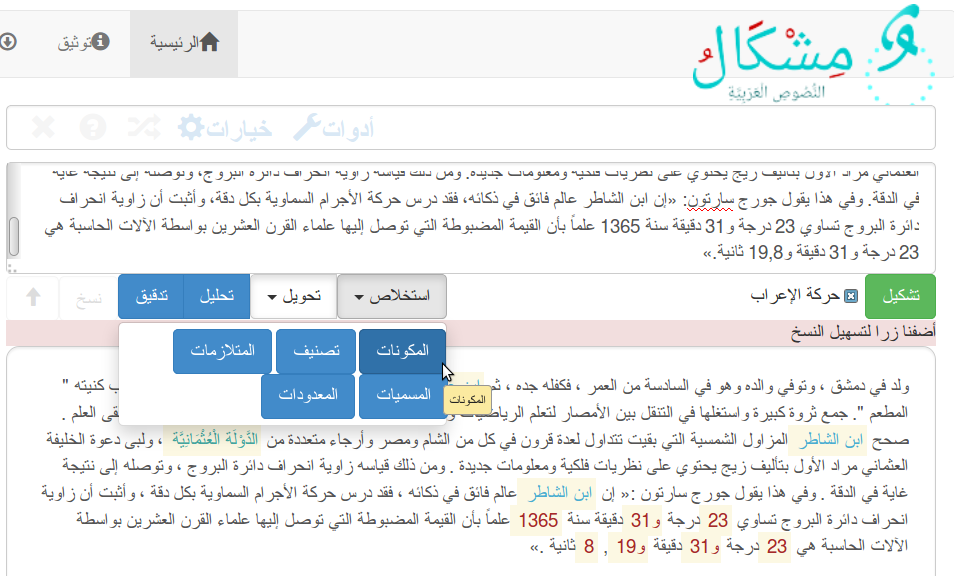

# مشطار: استخلاص المسميات والعبارات الزمنية Mishtar: Named and temporal entities chunker


استخلاص العبارات الاسمية والزمنية من النص مفيدة للتحليل النحوي،
Chunking is to extract named entities and temporal expression.


  Developpers:  Taha Zerrouki: http://tahadz.com
    taha dot zerrouki at gmail dot com

Features |   value
------------|-----------
Authors  | Taha Zerrouki: http://tahadz.com,  taha dot zerrouki at gmail dot com
Release  | 0.3
License  |[GPL](https://github.com/linuxscout/mishtar/master/LICENSE)
Tracker  |[linuxscout/mishtar/Issues](https://github.com/linuxscout/mishtar/issues)
Website  |[https://pypi.python.org/pypi/mishtar](https://pypi.python.org/pypi/mishtar)
Source  |[Github](http://github.com/linuxscout/mishtar)
Feedbacks  |[Comments](https://github.com/linuxscout/mishtar/issues)
Accounts  |[@Twitter](https://twitter.com/linuxscout)  [@Sourceforge](http://sourceforge.net/projects/mishtar/)

<!--Doc  |[package Documentaion](http://pythonhosted.org/mishtar/)-->
<!--Download  |[pypi.python.org](https://pypi.python.org/pypi/mishtar)-->


<!--
## Citation
If you would cite it in academic work, can you use this citation
```
T. Zerrouki‏, mishtar,  Arabic Word Tagger,
  https://pypi.python.org/pypi/mishtar/, 2018
```
or in bibtex format

```bibtex
@misc{zerrouki2012mishtar,
  title={mishtar : Arabic Word Tagger},
  author={Zerrouki, Taha},
  url={https://pypi.python.org/pypi/mishtar,
  year={2010}
}
```
-->

## مزايا
* استخلاص المسميات
* استخلاص العبارات الزمنية (تواريخ ميلادية وهجرية، ونسبية)

## Features
* Extract named entities
* Extract Tempral expressions

Applications
====
* Text mining.
* Text summarizing.
* Sentences identification.
* Grammar analysis.
* Morphological analysis acceleration.
* Extraction of ngrams..

تطبيقات 
====
* التنقيب عن المعلومات.
* تلخيص النص.
* التعرف على الجمل.
* التحليل النحوي.
* تسريع التحليل الصرفي.
* استخراج المصطلحات والمسكوكات والمتلازمات.


Demo جرّب
====
يمكن التجربة على [موقع مشكال](http://tahadz.com/mishkal)
، اختر أدوات، ثم استخلاص ثم المكونات
You can test it on [Mishkal Site](http://tahadz.com/mishkal), choose: Tool > extraction > Entities



### Installation

```
pip install mishtar
```

### Usage
```python
import mishtar.mynamed as mynamed
```
* Example **Test named entities**

```python
import mishtar.mynamed
import pyarabic.araby as araby
TEXTS = [
    u"جاء  خالد بن الوليد وقاتل مسيلمة بن حذام الكذاب في موقعة الحديقة",
    u'''روى أحمد بن عقيل الشامي عن أبي طلحة
 المغربي أنّ عقابا بن مسعود بن أبي سعاد قال''',
    u"صرّح الأمير تشارلز الأول",
]
chunker = mishtar.mynamed.myNamed()
for text1 in TEXTS:
    word_list = araby.tokenize(text1)
    tag_list2 = chunker.detect_chunks(word_list)
    result = chunker.pretashkeel(word_list)
    print("tashkeel", (u' '.join(result)))
    tuples = (zip(tag_list2, word_list))
    for tup in tuples:
        print(tup)
****Result ****
 المغربي أنّ عقابا بْنَ مسعود بْنِ أبي سعاد قال
(u'0', u'روى')
('NB', u'أحمد')
('NI', u'بن')
('NI', u'عقيل')
('NI', u'الشامي')
(u'0', u'عن')
('NB', u'أبي')
('NI', u'طلحة')
(u'0', u'')
(u'0', u'المغربي')
(u'0', u'أنّ')
('NB', u'عقابا')
('NI', u'بن')
('NI', u'مسعود')
('NI', u'بن')
('NI', u'أبي')
('NI', u'سعاد')
(u'0', u'قال')
tashkeel صرّح الأمير تشارلز الأول
(u'0', u'صرّح')
(u'0', u'الأمير')
(u'0', u'تشارلز')
(u'0', u'الأول')
```

* Test Temporal expressions


```python
import pyarabic.araby as araby
import mishtar.mytemped as mytemped
texts =[
'* قسم واحد فقط: شهر نوفمبر سنة 2015، ',
u'* قسمين : شهر أكتوبر 1973، الخامس من نوفمبر، ', 
u'* ثلاثة اقسام: يوم الجمعة الخامس عشر من شهر رمضان سنة 1435 هجرية.', 
]
chunker = mytemped.myTemped()
for text1 in texts:
    word_list = araby.tokenize(text1)
    tag_list2 = chunker.detect_chunks(word_list)
    print(text1)

    tuples = (zip(tag_list2, word_list))
    for tup in tuples:
        print(tup)
***Result ***
* قسم واحد فقط: شهر نوفمبر سنة 2015، 
(u'0', u'*')
(u'0', u'قسم')
(u'0', u'واحد')
(u'0', u'فقط')
(u'0', u':')
(u'NB', u'شهر')
(u'NI', u'نوفمبر')
(u'NB', u'سنة')
(u'NI', u'2015')
(u'0', u'،')
* قسمين : شهر أكتوبر 1973، الخامس من نوفمبر، 
(u'0', u'*')
(u'0', u'قسمين')
(u'0', u':')
(u'NB', u'شهر')
(u'NI', u'أكتوبر')
(u'NI', u'1973')
(u'0', u'،')
(u'NB', u'الخامس')
(u'NI', u'من')
(u'NI', u'نوفمبر')
(u'0', u'،')
* ثلاثة اقسام: يوم الجمعة الخامس عشر من شهر رمضان سنة 1435 هجرية.
(u'0', u'*')
(u'0', u'ثلاثة')
(u'0', u'اقسام')
(u'0', u':')
(u'NB', u'يوم')
(u'NI', u'الجمعة')
(u'NI', u'الخامس')
(u'NI', u'عشر')
(u'NI', u'من')
(u'NI', u'شهر')
(u'NI', u'رمضان')
(u'NB', u'سنة')
(u'NI', u'1435')
(u'NI', u'هجرية')
(u'0', u'.')

```


